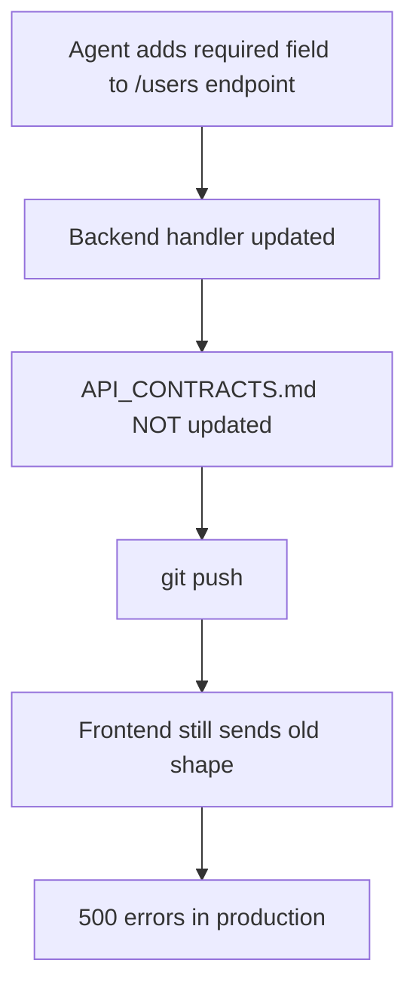

# Contract Enforcement

API contracts drift when agents make changes to endpoints without updating the documentation. devnexus catches this at push time — before broken contracts reach your team.

## The Problem



This happens constantly with AI agents. The agent focuses on the immediate task (update the handler) and doesn't think about downstream contracts. The code works locally because the agent is testing against the new shape. The frontend breaks because nobody told it the contract changed.

## How devnexus Prevents This

### The Pre-Push Hook

When you run `git push`, the pre-push hook:

1. Diffs staged changes against the last push
2. Checks if any files in API-related directories changed (`routes/`, `routers/`, `api/`, `endpoints/`, `controllers/`, `schemas/`)
3. If API files changed but `API_CONTRACTS.md` was NOT updated → **blocks the push**

```bash
$ git push

 devnexus: contract drift detected

 API-related files changed:
   - src/routes/users.ts
   - src/schemas/user.ts

 But API_CONTRACTS.md was not updated.

 Options:
   1. Update API_CONTRACTS.md to reflect the changes
   2. Revert the API changes
   3. Skip with: git push --no-verify (not recommended)
```

### The Agent-Side Check

The `.ai-rules/` include a contract drift rule that agents read at session start. Before pushing, the agent is instructed to:

1. Diff its code changes against `API_CONTRACTS.md`
2. If a mismatch is found, stop and present three options:
   - **Update the contract** — if the API change is intentional
   - **Revert the code** — if the code diverged from the agreed contract
   - **Check downstream impact** — if unsure whether the change is safe

This means the check happens twice: once by the agent (during the session) and once by the git hook (at push time). The hook is the hard backstop.

## What API_CONTRACTS.md Looks Like

```markdown
## POST /api/users

Create a new user account.

**Request:**
| Field | Type | Required | Notes |
|-------|------|----------|-------|
| email | string | yes | Must be unique |
| password | string | yes | Min 8 characters |
| name | string | yes | Display name |

**Response (201):**
| Field | Type | Notes |
|-------|------|-------|
| id | uuid | |
| email | string | |
| name | string | |
| created_at | timestamp | ISO 8601 |

**Error Responses:**
- `409` — Email already exists
- `422` — Validation failed
```

This is the **final authority** on what the endpoint accepts and returns. If the code and the contract disagree, the code is wrong until the contract is deliberately updated.

## Why This Matters for Teams

In a solo project, you know what you changed. In a team:

- Engineer A changes the backend endpoint
- Engineer B's agent (on the frontend) reads `API_CONTRACTS.md` and codes against the *documented* shape
- If A didn't update the contract, B's agent builds against the wrong shape
- The pre-push hook catches A's oversight before it reaches the shared codebase

The contract is the handshake between repos. The hook enforces the handshake.

## Skipping the Hook

You can always override with `git push --no-verify`. The hook is a guardrail, not a wall. But when you skip it, you're accepting the risk that downstream consumers don't know about your API change.

## Next Steps

- **What decisions to log** → [Decision Logging](decision-logging.md)
- **How the git hooks work** → [Git Hooks Reference](../reference/git-hooks.md)
- **API_CONTRACTS.md format** → [Vault Structure](../reference/vault-structure.md)
