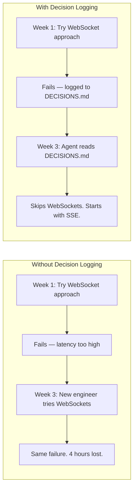

# Decision Logging

The highest-leverage habit in AI-assisted engineering is logging what didn't work. devnexus makes this automatic.

## The Problem

Engineering teams rediscover dead ends. Not because the information doesn't exist — someone learned it last week — but because it was never written down in a place the next person (or agent) would read.



## How It Works

### Live Decision Capture

The `.ai-rules/` instruct agents to log decisions as they happen — not at the end of the session, but in the moment an approach is rejected or a non-obvious choice is made.

When an agent tries something and it fails, or when you tell the agent "no, we can't do that because X," the agent writes it to `DECISIONS.md` immediately.

### The Format

```markdown
## 2026-04-15 — WebSocket approach rejected for real-time updates (by Alice)

Latency exceeded 200ms threshold under load. SSE with reconnection logic
chosen instead — simpler, lower latency, and works through corporate proxies.
```

Each entry is:
- **Date** — when the decision was made
- **Title** — what was decided (starts with the approach that was rejected or the choice that was made)
- **Author** — who was in the session
- **Body** — two sentences max. What happened and what was chosen instead.

Entries are reverse-chronological. The most recent decisions are at the top — agents read the latest context first.

## What To Log

| Log This | Don't Log This |
|----------|---------------|
| Approach tried and rejected (with why) | Obvious choices ("used React because it's in the stack") |
| Non-obvious constraint discovered | Implementation details (that's what code is for) |
| Architecture choice between two viable options | Bug fixes (that's what git history is for) |
| External dependency decision (and why) | Style preferences (that's what `.ai-rules/` is for) |
| Rollback or revert (and what triggered it) | Routine refactoring |

The filter: **would a future engineer (or agent) waste time if they didn't know this?** If yes, log it.

## How Agents Use It

At session start, the agent reads `DECISIONS.md` before writing any code. The `.ai-rules/` include a specific instruction:

> Before proposing an alternative approach, check `DECISIONS.md` for already-rejected approaches.

This means the agent won't suggest something that was already tried and failed. It's not a hard block — the agent can still propose a rejected approach if circumstances changed — but it has to acknowledge the prior decision.

## The Compound Effect

Decision logs compound in value over time:

- **Week 1:** 3 decisions logged. Minor time savings.
- **Month 1:** 20 decisions logged. New engineers onboard in half the time.
- **Month 6:** 80 decisions logged. The vault is a navigable history of every architectural choice, constraint, and dead end. Agents working in this codebase are significantly more effective than agents working without it.

The vault becomes an institutional memory that survives engineer turnover, agent session resets, and project pivots.

## Next Steps

- **How contracts are enforced** → [Contract Enforcement](contract-enforcement.md)
- **Working with multiple agents** → [Multi-Agent Workflows](multi-agent-workflows.md)
- **Full vault file reference** → [Vault Structure](../reference/vault-structure.md)
