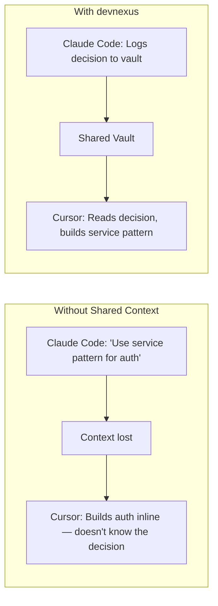
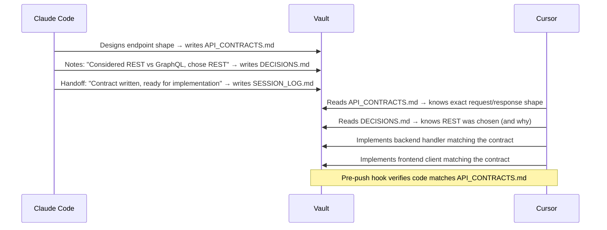

# Multi-Agent Workflows

Most teams don't use one AI agent for everything. Different agents are better at different tasks. devnexus gives them all the same brain.

## The Problem

When you use Cursor for a quick bug fix and Claude Code for architecture review, they don't share context. Cursor doesn't know what Claude Code decided. Claude Code doesn't know what Cursor changed. Each agent operates in isolation, and the work fragments.



## The Pattern

Different agents for different scopes:

| Task | Best Agent | Why |
|------|-----------|-----|
| Cross-repo architecture, system design | **Claude Code** | Large context window, sees the full workspace |
| Component edits, bug fixes (1-5 files) | **Cursor** | Fast, tactical, stays scoped to the immediate task |
| Code review, PR analysis | **Codex** | Good at reviewing diffs and catching issues |
| Rapid prototyping, exploration | **Windsurf** | Quick iteration cycle |

The key insight: **the agents are interchangeable hands, the vault is the shared brain.** It doesn't matter which agent writes a decision to `DECISIONS.md` — every other agent reads it on its next session start.

## How It Works

### Shared Rules

Every agent reads the same `.ai-rules/` protocol:

1. Read the vault at session start (same order, same files)
2. Update `DECISIONS.md` when approaches are rejected
3. Check `API_CONTRACTS.md` before API changes
4. Write a handoff note to `SESSION_LOG.md` at session end

The rules are agent-agnostic. They describe *what* to do, not *how* a specific agent should do it.

### Agent-Specific Config

The only difference between agents is how they receive the rules:

- **Claude Code** and **Codex** get pointer files → read `.ai-rules/` as a directory
- **Cursor** and **Windsurf** get inline files → rules concatenated into `.cursorrules` / `.windsurfrules`

Same rules, different delivery mechanism. `devnexus agent add <name>` handles this automatically.

### The Handoff

When you switch from one agent to another mid-project:

1. Agent A writes a handoff note to `SESSION_LOG.md`: *"Refactored auth to service pattern. Left off at integration tests."*
2. Agent B starts, reads `SESSION_LOG.md`, and picks up exactly where A left off

No copy-pasting context between agents. No re-explaining what you've been working on. The vault carries the state.

## Example: Full-Stack Feature

Building a new endpoint that spans frontend and backend:



Claude Code does the architectural thinking. Cursor does the implementation. Neither needs to know about the other — the vault is the interface between them.

## Managing Multiple Agents

```bash
# See what's configured
devnexus agent ls

# Add a new agent
devnexus agent add codex

# Remove one
devnexus agent rm windsurf

# Interactive selection
devnexus agent
```

## Next Steps

- **Agent-specific setup details** → [Agent Setup](../getting-started/agent-setup.md)
- **How the AI profile works** → [Config Reference](../reference/config.md)
- **Full command reference** → [Commands](../reference/commands.md)
