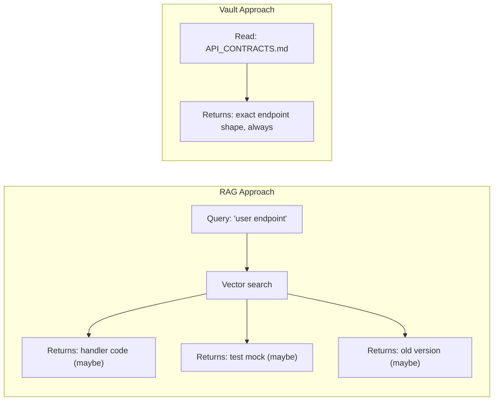

# Vault as Source of Truth

devnexus uses an Obsidian vault as the single source of truth for engineering decisions, API contracts, and architectural knowledge. When code and docs disagree, you update the code — the vault wins.

## Why Markdown, Not a Database

| Approach | Pros | Cons |
|----------|------|------|
| **Database / API** | Structured, queryable | Agents can't read it natively, requires tooling |
| **Vector store (RAG)** | Handles large corpora | Probabilistic, misses decisions, can't enforce contracts |
| **Markdown in a vault** | Every agent reads it natively, git-synced, human-browsable | Manual updates (but agents do most of the updating) |

Markdown is the universal input format for AI agents. Every major coding agent — Cursor, Claude Code, Codex, Windsurf — reads `.md` files natively. No SDK, no API integration, no retrieval pipeline. The agent opens the file and reads it.

This means the vault works with any agent, any editor, and any future tool that reads text files. There's no lock-in because there's no proprietary layer.

## Deterministic vs Probabilistic Context

RAG-based context retrieval is probabilistic. You embed your codebase, query with a natural language question, and get back chunks that are *similar* to the query. This works for "find code that looks like X." It fails for:

- **"What approaches were rejected?"** — Rejected approaches aren't in the code
- **"What's the exact shape of the /users endpoint?"** — RAG might return an old version, a test mock, or a similar-but-different endpoint
- **"Where did the last session leave off?"** — Session context isn't in the codebase

devnexus is deterministic. The agent reads `DECISIONS.md` — every decision is there, in order, every time. It reads `API_CONTRACTS.md` — the exact endpoint shapes, not a probabilistic retrieval of something similar.

## The Vault Files

| File | What It Contains | When It's Updated |
|------|-----------------|-------------------|
| **MOC.md** | Entry point — links to everything, repo table | When repos are added/removed |
| **ARCHITECTURE_OVERVIEW.md** | System design, tech stack, how repos connect, god nodes | After structural changes or `devnexus index` |
| **API_CONTRACTS.md** | Endpoint definitions — routes, request/response shapes, status codes | When any API changes (enforced by pre-push hook) |
| **DECISIONS.md** | Rejected approaches and non-obvious choices, reverse-chronological | During sessions when approaches fail or choices are made |
| **SESSION_LOG.md** | Two-line handoff notes per session | End of every session |
| **GRAPH_REPORT.md** | Structural analysis — god nodes, bridges, knowledge gaps | After `devnexus index` |
| **NODE_INDEX.md** | Full symbol table with communities and betweenness centrality | After `devnexus index` |
| **nodes/** | Per-community directories with individual symbol files | After `devnexus index` |

## The Read Order

Agents read the vault in a specific order at session start:

1. **`~/.ai-profile/`** — How you work (preferences, corrections, working style)
2. **`MOC.md`** — Orient: what repos exist, where things are
3. **`DECISIONS.md`** — What's been tried and rejected
4. **`SESSION_LOG.md`** — Where the last session left off
5. **`ARCHITECTURE_OVERVIEW.md`** — System design (on demand, not always)
6. **`NODE_INDEX.md`** — Code graph navigation (if populated)

This order is intentional. Decisions and session state are read before architecture because they change more frequently and are more likely to prevent wasted work.

## Docs-as-Code

The vault isn't documentation in the traditional sense — it's a live engineering artifact. Agents read it before writing code. Agents update it when something changes. The git hooks enforce consistency.

If you think of documentation as something humans write for other humans to read later, the vault is different. It's something agents write for other agents (and humans) to read *now*.

## Next Steps

- **How contract enforcement works** → [Contract Enforcement](contract-enforcement.md)
- **What decisions to log** → [Decision Logging](decision-logging.md)
- **Full vault file reference** → [Vault Structure](../reference/vault-structure.md)
