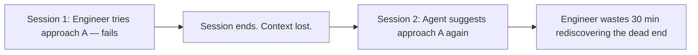
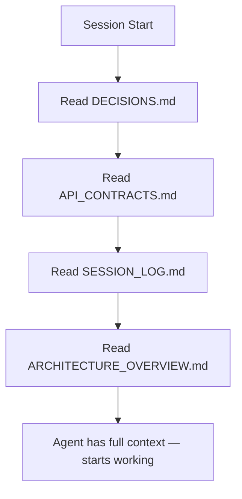

# Why AI Agents Forget Your Codebase

Every AI coding agent — Cursor, Claude Code, Codex, Windsurf — starts each session with a blank slate. They don't remember what was tried yesterday, what architectural decisions were made, or why a particular approach was rejected.

## The Problem

This isn't a bug in any particular agent. It's structural. AI agents operate within session-scoped context windows. When the session ends, everything the agent learned — your architecture, your constraints, your dead ends — evaporates.

### What `.cursorrules` and `CLAUDE.md` Don't Solve

Static rule files tell agents *how* to behave (formatting, coding style, tool preferences). They don't tell agents *what happened* — which approaches failed, which API contracts exist, or where the last session left off.

A `.cursorrules` file can say "use Supabase for database access." It can't say "we tried connecting the frontend directly to Supabase and it caused row-level security issues — route through the backend API instead."

### The Compound Cost

| Session | What Happens | Time Lost |
|---------|-------------|-----------|
| 1 | Engineer A discovers approach X doesn't work | 30 min |
| 2 | Engineer A's agent re-suggests approach X | 20 min |
| 5 | Engineer B joins, agent suggests approach X again | 30 min |
| 10 | New hire onboards, nobody remembers *why* X was rejected | 1 hour |

The cost compounds with team size and project age. Every undocumented decision is a trap waiting for the next person who touches that code.

## Why RAG Doesn't Fix This

Retrieval-Augmented Generation (RAG) indexes your codebase into vector embeddings and retrieves "relevant" chunks. It's great for finding similar code. It's terrible for decisions.

**Decisions are not in the code.** The code shows *what* was built. It doesn't show what was *rejected*, why, or what constraints led to the current approach. A vector search over your codebase will never surface "we tried microservices and rolled back because deploy latency was unacceptable" — because that sentence doesn't exist in any source file.

**Contracts drift silently.** Your backend adds a new required field to an endpoint. RAG might retrieve the updated handler code, but it won't flag that the frontend is still sending the old shape. The mismatch only surfaces at runtime.

## What Actually Works: Deterministic Context

Instead of probabilistic retrieval, devnexus creates a deterministic context layer — markdown files that agents read at session start, every time, in the same order:

No embeddings. No similarity search. No probabilistic retrieval. The agent reads the files. The files contain the decisions. The decisions persist across sessions.

When Engineer A logs "Approach X failed because of Y" to `DECISIONS.md`, Engineer B's agent reads it on its next session start and never suggests approach X.

## How devnexus Implements This

- **`DECISIONS.md`** — Reverse-chronological log of rejected approaches and non-obvious choices
- **`API_CONTRACTS.md`** — Endpoint shapes that serve as the final authority on request/response formats
- **`SESSION_LOG.md`** — Two-line handoff notes so the next session picks up where the last one left off
- **`ARCHITECTURE_OVERVIEW.md`** — System design, how repos connect, key data structures
- **`.ai-rules/`** — Rules that tell agents to read these files and when to update them
- **Git hooks** — pre-push check that blocks if API contracts are stale

The result: agents that remember what happened, even when the session that learned it is long gone.

## Next Steps

- **How the vault works** → [Vault as Source of Truth](vault-as-source-of-truth.md)
- **Set it up** → [Quick Start](../getting-started/quick-start.md)
