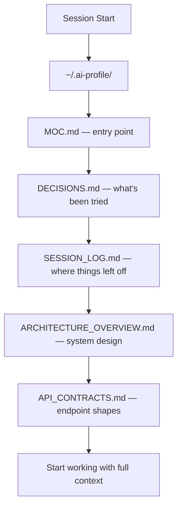

# Join an Existing Workspace

Your team already has a devnexus workspace. Here's how to plug in and immediately inherit every decision, contract, and dead end they've already documented.

## What You're Joining

A devnexus workspace is:
- An **Obsidian vault** (git-synced) containing architecture docs, API contracts, and decision logs
- **Agent rules** (`.ai-rules/`) that tell your AI agent how to read and update the vault
- **Git hooks** that enforce contract consistency on push

When you join, your AI agent starts its first session with the same context your teammates have built over weeks or months.

## Setup

### Option 1: Join via Vault URL

```bash
mkdir my-project && cd my-project
devnexus init
```

When prompted, choose **"Join existing workspace"** and provide the vault's git URL:

```
? Create new workspace or join existing? Join existing
? Vault git URL or local path: git@github.com:team/my-project-vault.git
? Your name (for session logs): Alice
? Repository paths: ./frontend, ./backend
? Select AI agents: Claude Code, Cursor
```

devnexus clones the vault, sets up `.ai-rules/` in each repo, installs git hooks, and configures your agent pointers.

### Option 2: Clone Manually + Init

If you already have the vault cloned:

```bash
devnexus init
# Choose "Join existing"
# Point to the local vault folder instead of a URL
```

## Vault Sync

The vault auto-syncs via the [Obsidian Git](https://github.com/denolehov/obsidian-git) plugin:

- **Auto-commit** every 1 minute (captures your session's changes)
- **Auto-pull** every 1 minute (picks up teammates' changes)
- **Auto-push** after each commit

This means when Engineer A logs a failed approach to `DECISIONS.md`, Engineer B's agent sees it within minutes — without either engineer doing anything manual.

### Setting Up Obsidian Git

1. Open the vault folder in Obsidian
2. Install the **Obsidian Git** community plugin
3. devnexus already wrote the config — auto-save/pull/push are pre-configured
4. Make sure you have git credentials set up for the vault's remote

## What Your Agent Reads on First Session



On day one, your agent already knows:
- What the system architecture looks like
- What API contracts exist and their exact shapes
- What approaches were tried and rejected (and why)
- Where the last session left off

## Verify Setup

```bash
devnexus doctor
```

This checks that your vault, rules, hooks, and agent pointers are all wired up correctly. Use `devnexus doctor --fix` to auto-repair anything missing.

## Next Steps

- **How vault sync works in detail** → [Obsidian Git Integration](../integrations/obsidian-git.md)
- **Understanding the vault files** → [Vault Structure](../reference/vault-structure.md)
- **Full command reference** → [Commands](../reference/commands.md)
