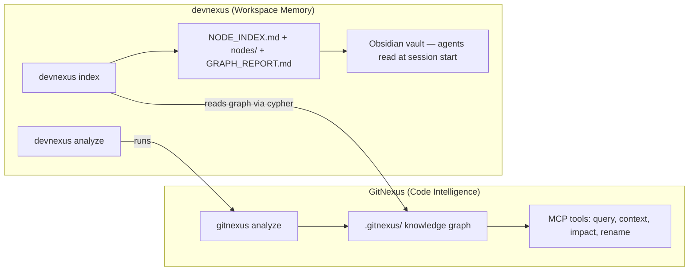

# GitNexus Integration

[GitNexus](https://github.com/abhigyanpatwari/GitNexus) indexes codebases into knowledge graphs. devnexus reads that graph and writes it into the vault as browsable Obsidian documentation.

GitNexus tells agents what the code *does*. devnexus tells agents what you *decided*. Together, they give agents both structural understanding and institutional memory.

## How They Connect



| Command | What It Does |
|---------|-------------|
| `devnexus analyze` | Runs `gitnexus analyze` on all workspace repos (or a specific one) |
| `devnexus index` | Queries the GitNexus graph, computes centrality, writes vault docs |

## What devnexus index Generates

`devnexus index` reads the raw GitNexus graph and produces navigable vault documentation:

### NODE_INDEX.md

Full symbol table with computed metrics:

```markdown
## God Nodes

| Symbol | BC | Edges | Cross-Community | File | Repo |
|--------|-----|-------|----------------|------|------|
| DealState | 0.142 | 39 | 3 | src/types/deal.ts | backend |
| ApiRouter | 0.087 | 22 | 4 | src/api/router.ts | backend |

## Communities

| Community | Hub Nodes | Members | Cohesion |
|-----------|-----------|---------|----------|
| auth | AuthService, validateToken | 12 | 0.78 |
| api | ApiRouter, handleRequest | 18 | 0.65 |
```

### nodes/ Directory

Per-community directories with browsable symbol files:

```
nodes/
├── auth/
│   ├── _COMMUNITY.md        # Hub nodes, all members, internal call graph
│   ├── AuthService.md        # Callers, callees, cross-references
│   └── validateToken.md
├── api/
│   ├── _COMMUNITY.md
│   ├── ApiRouter.md
│   └── handleRequest.md
```

Each symbol file shows:
- Who calls this symbol (incoming edges)
- What this symbol calls (outgoing edges)
- Which community it belongs to
- Cross-community connections

### GRAPH_REPORT.md

Structural analysis:
- **God nodes** — symbols with high betweenness centrality (bridge multiple communities)
- **Bridges** — sole edges connecting two communities (if this breaks, communities disconnect)
- **Knowledge gaps** — thin communities, low cohesion clusters, oversized modules
- **Graph diff** — what changed since the last index (new/removed god nodes, community shifts)

### ARCHITECTURE_OVERVIEW.md Injection

`devnexus index` injects a god node summary and community list into `ARCHITECTURE_OVERVIEW.md` between markers:

```markdown
<!-- devnexus:graph:start -->
### Key Structural Nodes
- **DealState** (BC: 0.142, 39 edges, 3 communities) — src/types/deal.ts
...

### Communities
- **auth** (12 symbols, cohesion: 0.78) — hub: AuthService, validateToken
...
<!-- devnexus:graph:end -->
```

Content outside the markers is untouched.

## Detection Thresholds

### God Nodes

A symbol is flagged as a god node if ANY of:
- >= 10 edges (calls + called-by)
- >= 3 cross-community reach
- Betweenness centrality > 0.05

Max 15 god nodes surfaced, sorted by BC (primary), cross-community count (secondary), edge count (tertiary).

### Bridges

An edge is a bridge if it's the **sole call edge** between two communities. Removing it would disconnect the communities in the call graph.

### Knowledge Gaps

| Type | Condition | What It Means |
|------|-----------|--------------|
| **Thin** | <= 2 symbols | Possible dead code or undocumented entry points |
| **Low cohesion** | < 0.2 and > 3 symbols | Symbols may not belong together |
| **Oversized** | > 50 symbols | Needs splitting |
| **Flat** | No hub with >= 3 edges | Hard to find entry points |

## GitNexus MCP Tools via devnexus

The repo-level `.ai-rules/05-code-intelligence.md` instructs agents to use GitNexus MCP tools:

| Tool | When To Use |
|------|------------|
| `gitnexus_query()` | Find code by concept — hybrid search (BM25 + semantic) |
| `gitnexus_context()` | 360-degree symbol view — callers, callees, process participation |
| `gitnexus_impact()` | Blast radius before editing — MUST run before changing any symbol |
| `gitnexus_rename()` | Multi-file coordinated rename (never use find-and-replace) |
| `gitnexus_detect_changes()` | Pre-commit impact — map changed lines to affected processes |

## Automatic Indexing

devnexus installs git hooks that keep GitNexus fresh:

| Hook | What It Runs |
|------|-------------|
| **post-commit** | `gitnexus analyze` — rebuilds graph after every commit |
| **post-merge** | `gitnexus analyze` + warns if symbol count shifted > 10% |

You only need to run `devnexus index` manually when you want to regenerate the vault documentation (NODE_INDEX.md, nodes/, GRAPH_REPORT.md).

## Setup

GitNexus is optional but recommended. If not installed, devnexus skips the code intelligence features and the hooks exit silently.

```bash
npm install -g gitnexus
npx gitnexus setup        # Configure MCP for your editors (one-time)
devnexus analyze          # Index all workspace repos
devnexus index            # Generate vault documentation from the graph
```

## Next Steps

- **Vault sync for teams** → [Obsidian Git](obsidian-git.md)
- **What the vault contains** → [Vault Structure](../reference/vault-structure.md)
- **Full command reference** → [Commands](../reference/commands.md)
