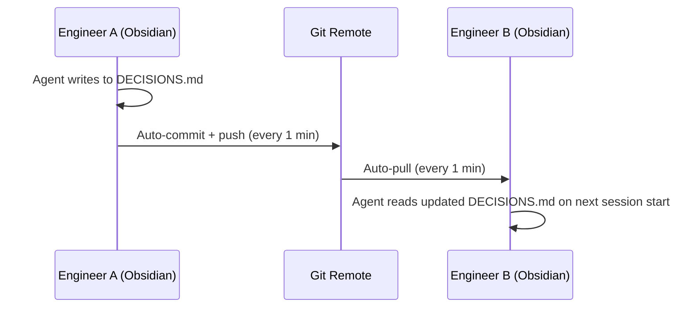

# Obsidian Git Integration

devnexus vaults sync across team members using the [Obsidian Git](https://github.com/denolehov/obsidian-git) community plugin. When one engineer logs a decision, every other engineer's agent sees it within minutes.

## How It Works



The plugin handles commit, push, and pull automatically. No manual git operations needed for vault sync.

## Pre-Configured Settings

devnexus writes the Obsidian Git config during `devnexus init`:

| Setting | Value | Why |
|---------|-------|-----|
| Auto-save interval | 1 minute | Captures changes quickly |
| Auto-pull interval | 1 minute | Picks up teammates' changes quickly |
| Auto-push after commit | Enabled | Changes reach the remote immediately |
| Commit message format | `vault: {{date}} by {{author}}` | Clean, attributable history |

These settings live in `.obsidian/plugins/obsidian-git/data.json` inside the vault.

## Setup

### 1. Create a Git Remote for the Vault

```bash
cd my-project-vault
git init
git remote add origin git@github.com:team/my-project-vault.git
git add -A && git commit -m "initial vault"
git push -u origin main
```

Or if the vault was created by `devnexus init`, it may already have a `.git/` — just add the remote.

### 2. Install Obsidian Git Plugin

1. Open the vault folder in Obsidian
2. Go to Settings → Community Plugins → Browse
3. Search for "Obsidian Git" and install it
4. Enable the plugin

The config is already written by devnexus — auto-save, auto-pull, and auto-push should be active immediately.

### 3. Verify

Make a small edit in the vault. Within 1 minute, you should see:
- A commit in the git log: `vault: 2026-04-15 12:30 by Alice`
- The commit pushed to the remote

On another machine with the same vault cloned and Obsidian Git enabled, the change should appear within 1 minute.

## Conflict Resolution

With 1-minute sync intervals, conflicts are rare but possible (two engineers editing the same line of the same file within the same minute).

Obsidian Git handles conflicts by:
1. Pulling before committing
2. If a merge conflict occurs, marking it in the file with standard git conflict markers
3. You resolve manually in Obsidian, then the next auto-commit picks up the resolution

In practice, most vault files are append-only (DECISIONS.md, SESSION_LOG.md) or section-scoped (ARCHITECTURE_OVERVIEW.md), so conflicts are uncommon.

## Team Onboarding

When a new engineer joins:

1. Clone the vault: `git clone git@github.com:team/my-project-vault.git`
2. Run `devnexus init` → choose "Join existing" → point to the vault
3. Open the vault in Obsidian, install Obsidian Git plugin
4. Start coding — the agent reads the full history of decisions, contracts, and session logs

The new engineer's agent immediately has access to every decision the team has ever logged. No onboarding docs needed beyond what's already in the vault.

## Without Obsidian

If you don't want to use Obsidian, the vault still works. It's just markdown files in a git repo. You can:

- Read/edit them in any text editor or IDE
- Sync with standard git commands (`git pull`, `git push`)
- Set up a cron job or watch script for auto-sync

Obsidian adds browsability (graph view, backlinks, search) and auto-sync via the Git plugin, but neither is required.

## Next Steps

- **Join an existing workspace** → [Join Existing Workspace](../getting-started/join-existing-workspace.md)
- **GitNexus integration** → [GitNexus](gitnexus.md)
- **What the vault contains** → [Vault Structure](../reference/vault-structure.md)
